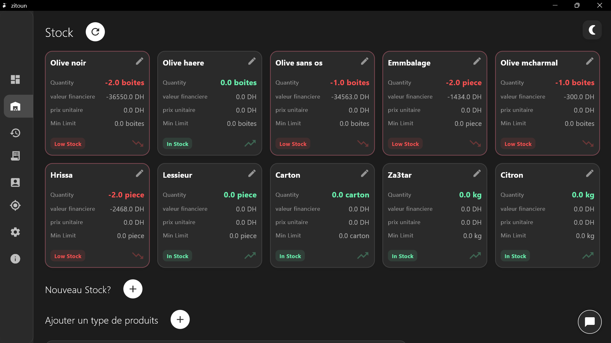
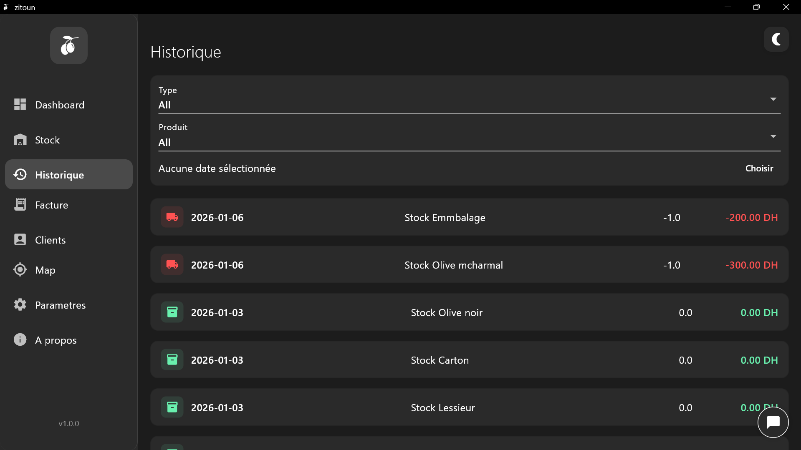
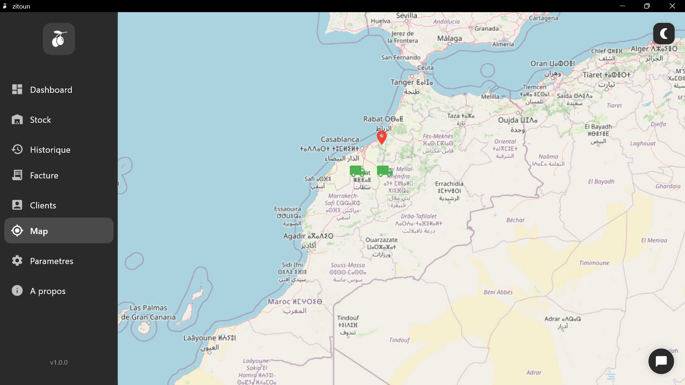
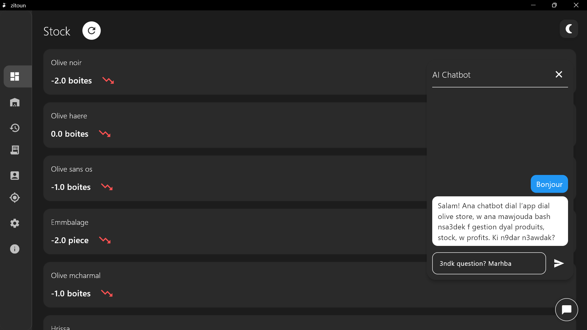

<!-- =============================== -->
<!--  STARTUP MANAGEMENT DESKTOP APP -->
<!-- =============================== -->

  <h1 style="font-size: 42px; margin-bottom: 10px;">
     Zitoun Desktop App
  </h1>

  

    A cross-platform <b>desktop application</b> designed to manage the daily operations
    of a Moroccan startup, including <b>stock management</b>, <b>invoicing</b>,
    <b>vehicle tracking</b>, and <b>activity history</b>.
  

   

  
  
  
  

<h2> Project Overview</h2>

This project is a <b>desktop management system</b> developed to support the operational
needs of a startup based in <b>Morocco</b>.
It centralizes key business processes into a single, modern, and intuitive application.

The system provides real-time visibility into stock levels, invoicing,
vehicle locations, and historical activities, helping startup teams
make informed decisions efficiently.

<h2> Desktop Application (Flutter)</h2>

The user interface is built using <b>Flutter</b> with <b>Dart</b>,
ensuring a responsive and consistent experience across desktop platforms.

<h3> Main Features</h3>
<ul>
  <li>Stock management and inventory tracking</li>
  <li>Invoice generation and history</li>
  <li>Vehicle tracking on an interactive map</li>
  <li>Activity and transaction history</li>
  <li>Integrated AI-based insights</li>
</ul>

  <h3> Stock Management</h3>
  

    

  <h3> Activity & Invoice History</h3>
  

    

  <h3> Vehicle Tracking</h3>
  

    

  <h3> AI Insights</h3>
  

<h2> Backend (Node.js)</h2>

The backend is implemented using <b>Node.js</b> and provides a robust API layer
for the desktop application.

<h3> Responsibilities</h3>
<ul>
  <li>Business logic and request handling</li>
  <li>Stock and invoice processing</li>
  <li>Vehicle location updates</li>
  <li>Secure communication with the database</li>
</ul>

<h2> Database (Supabase)</h2>

The system uses <b>Supabase</b> as a backend-as-a-service solution to manage:

<ul>
  <li>Structured relational data</li>
  <li>Real-time updates</li>
  <li>Authentication-ready infrastructure</li>
</ul>

Supabase provides scalability and reliability while reducing backend maintenance complexity.

<h2> System Architecture</h2>

<ul>
  <li><b>UI Layer:</b> Flutter (Dart)</li>
  <li><b>API Layer:</b> Node.js</li>
  <li><b>Data Layer:</b> Supabase</li>
</ul>

<h2> Technology Stack</h2>

<table>
  <tr>
    <th align="left">Layer</th>
    <th align="left">Technologies</th>
  </tr>
  <tr>
    <td>Desktop UI</td>
    <td>Flutter, Dart</td>
  </tr>
  <tr>
    <td>Backend</td>
    <td>Node.js, REST APIs</td>
  </tr>
  <tr>
    <td>Database</td>
    <td>Supabase (PostgreSQL)</td>
  </tr>
</table>

<h2> Key Benefits</h2>

<ul>
  <li>Centralized startup management</li>
  <li>Real-time operational visibility</li>
  <li>Scalable and maintainable architecture</li>
  <li>Modern and intuitive user interface</li>
</ul>

  <h3> Built for Moroccan Startups</h3>
  

    This application is designed to address the real-world operational challenges
    faced by growing startups in Morocco.
  

